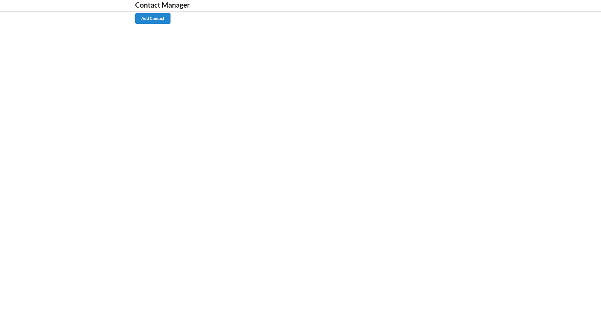
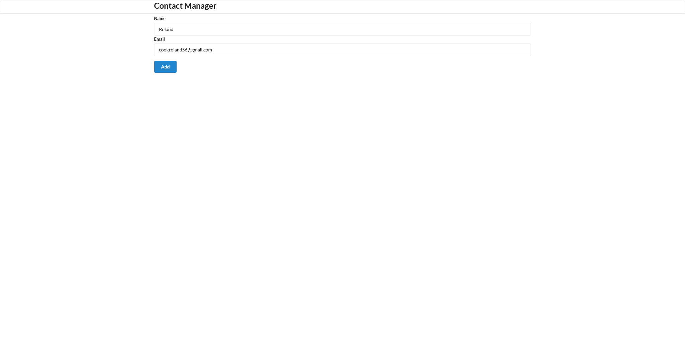

## Table of contents
* [General info]
* [Technologies]
* [Setup]

## General info
This project was created to be a simple way to save contacts using local storage. 

Once you click "Add Contact" you will be taken to a page where you can create a contact, enter the name and email you want to associate with them. 

After you click "Add" you will be shown a list of all the contacts you have added so far. Note that you can also remove contacts using the red trash bin under the image.
	
## Technologies
Project is created with:
* HTML: 5
* CSS : 3
* Javascript
* React

<h1> Home Page <h1>

<h1> Create Contact <h1>
  

  
 <h1> Display All Contacts <h1>
   

	

In the project directory, you can run:

### `npm start`

Runs the app in the development mode.\
Open [http://localhost:3000](http://localhost:3000) to view it in the browser.

The page will reload if you make edits.\
You will also see any lint errors in the console.
